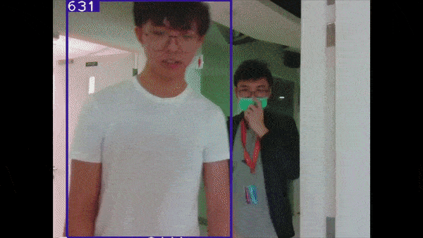

# person_tracking_ros
A ros package that tracks a selected target person using YOLOv3 and DeepSORT




# Published Topics and Provided Services
## Published topics
|Topic Name|Message Type|Purpose|
|----------|------------|-------|
|/person_tracking/bbox_center|geometry_msgs.Point|Publishes the centerpoint of the target bounding box when a person is selected as target|
|/person_tracking/target_angle|std_msgs.Float32|Publishes the angle of the target bounding box when a person is selected as target. Uses the `person_tracker/camera_fov` param declared in person_tracker.launch to compute angle.|
|/person_tracking/target_present|std_msgs.Bool|Publishes **True** if selected target person is present in the camera view. Publishes **False** if person is not present.|
|/person_tracking/target_indice|std_msgs.Int32|Publishes the indice of the selected target person. If no person is selected, publishes **0**.|
|/person_tracking/detection_indices|std_msgs.Int32MultiArray|Publishes an array of all detection indices when no person is selected as target. Publishes target indice if target is selected.|
|/person_tracking/deepsort_image/compressed|sensor_msgs.CompressedImage|Publishes a compressed image of drawn bounding box of detections and track processed by tracker|

## Services
|Service Name|Input Type and Name|Output Type and Name|Purpose|
|---|---|---|---|
|/person_tracking/clear_target|std_msgs.Bool clear|std_msgs.Bool success|Untracks selected target. Returns true if succeeded. Returns false if no error encountered or no track started|
|/person_tracking/choose_target|std_msgs.Int32 target|std_msgs.Bool success|Choose indice for tracking. Returns true if indice present in camera and track started. Returns false if no detection available with given indices or track already started|


# Setup
## Requirements
### Python modules
- Python=3.6
- CUDA 10
- numpy
- scipy
- opencv-python
- sklearn
- torch >= 0.4
- torchvision >= 0.1
- pillow
- vizer
- edict
- pyyaml
- easydict
### ROS 
- ROS Melodic
- Any ROS Package for accessing webcam. I use [video_stream_opencv](http://wiki.ros.org/video_stream_opencv).

## Installation
Setup ROS Melodic and your catkin_ws if you have not done so.

Install the required python 3 modules using pip3 or a virtualenv. Do not use Anaconda.
Git clone this repository into src of your catkin_ws. Follow
```
cd catkin_ws/src
git clone https://github.com/khayliang/person_tracking_ros.git
cd person_tracking_ros
```
Download the YOLOv3 weights 
```
cd src/weights
wget https://pjreddie.com/media/files/yolov3.weights
```
Download the reidentification weights into the folder from [this google drive](https://drive.google.com/file/d/1cwcKwl-LNdXXV4g-wntaypAHAZEDyeIS/view?usp=sharing).

Compile the nms module
```
cd ..
cd detector/YOLOv3/nms
sh build.sh
cd ../../../..
```
After installing your python modules, source the python intepreter.
```
cd bin
```
Open the file person_tracker.py with your preferred text editor

If you're using virtualenv, change the first line in the code accordingly:
```
#!/[path-to-virtualenv]/bin/python
```
If you directly installed to your python3:
```
#!/usr/bin/env python3
```
Once all that is done, make the package.
```
cd ../../..
catkin_make
```
## Configuring launch file
Open the launch file in person_tracking_ros/launch/person_tracker.launch

In this line:
```
  <node name="person_tracker" pkg="person_tracking" type="person_tracker.py" args="--img_topic /camera/image_raw/compressed" /> 
```
Change `/camera/image_raw/compressed` to your custom image topic. Only compressed image is supported.

# Running
## Initialization
Start your roscore
```
roscore
```
Start your camera stream node. Here, I'm using [video_stream_opencv](http://wiki.ros.org/video_stream_opencv).
```
roslaunch video_stream_opencv camera.launch
```
Ensure that your image topic is correctly set to your preferred tracker. Now source your workspace and run the tracker.
```
source /devel/setup.bash
roslaunch person_tracking person_tracker.launch
```
Tracker should now be running.

## Viewing tracker image output
The tracker publishes the image output in compressed form to the topic:

**/person_tracking/deepsort_image/compressed**

To select view the tracker output, use rqt_image_view
```
rqt_image_view
```
And choose the stated topic above to view the image.

## Choosing tracking target
The tracker uses a service to choose a target to track:

**/person_tracking/choose_target**

To choose a target, run the following commands.
```
rosservice call /person_tracking/choose_target [ENTER DETECTION INDICE HERE]
```
Service will return **True** if track is sucessfully started.

## Clearing tracked target
The tracker uses a service to  clear the track

**/person_tracking/clear_target**

To clear a target, run the following command.
```
rosservice call /person_tracking/clear_target true
```
Service will return **True** if track is successfully cleared.
