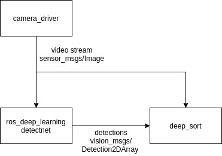

# person_tracking_ros
A ros2 package that tracks a selected target person using DeepSORT.

# Setup
## Requirements
### Python modules
- Python=3.6
- CUDA 10
- numpy
- scipy
- opencv-python
- sklearn
- torch >= 0.4
- torchvision >= 0.1
- pillow
- vizer
- edict
- pyyaml
- easydict
### ROS 
- ROS 2
- geometry_msgs
- sensor_msgs
- cv_bridge
- vision_msgs
- [person_tracking_interfaces](google.com)
- Some detection package. We use ros_deep_learning [detectnet](https://github.com/dusty-nv/ros_deep_learning)

## Installation

- Install the required python 3 modules using pip3 or a virtualenv. Do not use Anaconda.
- Download the reidentification weights from [this google drive](https://drive.google.com/file/d/1cwcKwl-LNdXXV4g-wntaypAHAZEDyeIS/view?usp=sharing).
- Configure your subscription topics, weights, and other stuff in `./configs/deep_sort.yaml`
## Notes
- This package requires an external detector to feed it bounding boxes of detections

# Topics and Services
## Required topics to subscribe
Topic names are configured in configs/deep_sort.yaml
|Message Type|Purpose|
|------------|-------|
|sensor_msgs.Image|Video source to perform tracking|
|vision_msgs.Detection2DArray|Array of detections. Bounding box format in xywh|
## Published topics
|Topic Name|Message Type|Purpose|
|----------|------------|-------|
|/person_tracking/bbox_center|geometry_msgs.Point|Publishes the centerpoint of the target bounding box when a person is selected as target|
|/person_tracking/target_angle|std_msgs.Float32|Publishes the angle of the target bounding box when a person is selected as target. Uses the `person_tracker/camera_fov` param declared in person_tracker.launch to compute angle.|
|/person_tracking/target_present|std_msgs.Bool|Publishes **True** if selected target person is present in the camera view. Publishes **False** if person is not present.|
|/person_tracking/target_indice|std_msgs.Int32|Publishes the indice of the selected target person. If no person is selected, publishes **0**.|
|/person_tracking/detection_indices|std_msgs.Int32MultiArray|Publishes an array of all detection indices when no person is selected as target. Publishes target indice if target is selected.|
|/person_tracking/deepsort_image|sensor_msgs.Image|Publishes a image of drawn bounding box of detections and track processed by tracker|

## Services
|Service Name|Input Type and Name|Output Type and Name|Purpose|
|---|---|---|---|
|/person_tracking/clear_target|std_msgs.Bool clear|std_msgs.Bool success|Untracks selected target. Returns true if succeeded. Returns false if no error encountered or no track started|
|/person_tracking/choose_target|std_msgs.Int32 target|std_msgs.Bool success|Choose indice for tracking. Returns true if indice present in camera and track started. Returns false if no detection available with given indices or track already started|

